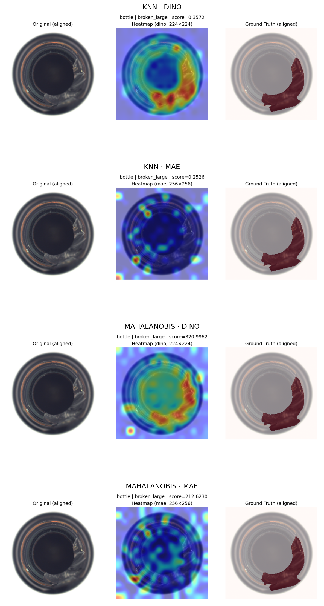

# 🔍 Unsupervised Anomaly Detection with Vision Transformers (MVTec AD)

This project implements **unsupervised anomaly detection** on the [MVTec Anomaly Detection dataset](https://www.mvtec.com/company/research/datasets/mvtec-ad) using modern **Vision Transformers (DINOv2, MAE)**.  
The goal is to detect manufacturing defects **without labeled anomalies**, leveraging pre-trained self-supervised models and distance-based scoring methods.

---

## 🚀 Project Overview

### 1. Motivation
- Industrial quality inspection often lacks sufficient **defect data** for supervised learning.
- Pre-trained **self-supervised Vision Transformers** provide strong image representations that can generalize to unseen anomalies.
- This project compares **CNN baselines** with **Transformer embeddings** for anomaly detection.

---

### 2. Methods

#### 🔹 Baselines
- **ResNet50 Feature Extraction**
- **K-Means Clustering** on ResNet features

#### 🔹 Transformer Embeddings
- **DINOv2-B/14** (Self-Supervised Vision Transformer)
- **MAE-B/16** (Masked Autoencoder)

#### 🔹 Scoring Approaches
- **KNN with Faiss** (cosine similarity, top-k neighbors)
- **Mahalanobis Distance** (with optional PCA & shrinkage)
- Both at **image-level** and **patch-level**

#### 🔹 Heatmaps
- Map patch-level anomaly scores to a spatial grid (e.g., 16×16)
- Bilinear interpolation to original image resolution
- Visualization as heatmaps for localizing defects

---

### 3. Repository Structure

```
mvtec-vit-anomaly/
├─ data/                     # (not included) raw MVTec dataset (train/test images & masks)
├─ src/
│  ├─ features_vit.py        # ViT feature extraction (DINOv2, MAE) + ResNet baseline
│  ├─ scoring.py             # Anomaly scoring methods (KNN, Mahalanobis)
│  ├─ eval.py                # Evaluation metrics (AUROC, PRO, PR curves)
│  ├─ app.py                 # Streamlit demo interface (planned)
├─ featurebanks/             # (not included) precomputed feature banks (npz + meta.csv)
├─ notebooks/
│  ├─ 00_eda.ipynb           # Exploratory data analysis (ResNet + KMeans baseline)
│  ├─ 01_feature_extraction_and_preview.ipynb  # Extract ViT/MAE features & preview embeddings
│  ├─ 02_scoring_heatmaps.ipynb                 # Anomaly scoring and heatmap visualization
├─ cached_dicts/             # (not included) cached embeddings/dictionaries for fast scoring
├─ features_dinov2_b14/      # (not included) extracted DINOv2-B/14 features
├─ features_mae_b16/         # (not included) extracted MAE-B/16 features
├─ scores_knn/               # (not included) KNN-based anomaly scores (CSV per category)
├─ scores_mahalanobis/       # (not included) Mahalanobis-based anomaly scores (CSV per category)
├─ assets/
│  ├─ heatmaps/              # qualitative examples of heatmaps (triplet comparisons)
├─ README.md                 # Project documentation
```

---

### 4. ⚠️ Pitfalls & Fixes

This section documents common issues encountered during feature extraction — and how they were resolved:

- **DataLoader collation**:  
  The default PyTorch `collate_fn` breaks metadata when batching dicts.  
  → ✅ *Fix:* use a custom `collate_keep_meta` function to preserve image-level metadata.

- **Overwrite behavior**:  
  Existing `.npz` and `.csv` files are skipped by default.  
  → ✅ *Fix:* pass `overwrite=True` to force regeneration.

- **Mixed precision**:  
  Automatic Mixed Precision (AMP) was enabled on GPU for faster inference.  
  → On CPU, AMP is disabled and falls back to standard FP32.

- **Performance variance (CPU vs. GPU)**:  
  Thanks to GPU acceleration, extracting features for **all 15 MVTec categories**  
  took about one hour.  
  → On CPU, this would require several hours due to the high model complexity (ViT-B).

- **Preprocessing considerations**:  
  Images are resized to a fixed input size (e.g. 224×224 or 256×256 depending on the model),  
  but no center cropping is applied.  
  This ensures that **image borders are preserved**, which is especially important  
  for anomaly detection tasks where defects may occur at the edges.  
  → ✅ This design choice improves robustness while remaining compatible with pretrained ViT backbones.

- **MAE patch masking (default = 0.75):**  
  By default, ViT-MAE randomly masks **75% of all patches** during forward passes,  
  leaving only ~64 visible out of 256. This is fine for reconstruction pretraining,  
  but not for feature extraction.  
  → ✅ *Fix:* disable masking at inference by passing `bool_masked_pos=None`  
  (or `mask_ratio=0.0`), so that embeddings for **all 256 patches** are preserved.

---

### 5. Results (so far)

- **ResNet50 + KMeans**: Separates `good` vs. `defect` at a coarse level.
- **ViT Embeddings** (DINOv2, MAE) show **clear improvements** in anomaly separability.
- **Image-level scores** already demonstrate good performance (`defect > good` on mean scores).

#### 🔥 Qualitative Heatmap Results

We also generated **patch-based anomaly heatmaps** for all models.  
Each triplet shows (left → right):

1. Original image (aligned to backbone input size)  
2. Predicted anomaly heatmap (overlay)  
3. Ground-truth mask  

Below is an example from the `bottle` category (`broken_large` defect), comparing all four method/backbone combinations:



**Observations:**
- **DINO (both KNN & Mahalanobis)**:  
  Clear localization of the defective region; heatmaps align well with ground-truth.  
  - KNN → slightly more scattered activations (patch-wise).  
  - Mahalanobis → smoother, more globally consistent maps.  
- **MAE (both KNN & Mahalanobis)**:  
  Heatmaps are much less informative, often showing random activations not aligned with the defect.  
  → MAE features are weaker for spatial localization, though they can still separate *good vs. defect* at image level.  

**Conclusion:**  
For **localization**, DINO features are clearly superior.  
MAE embeddings mainly help on a global (image-level) scale but lack fine-grained patch information.

---

### 6. Next Steps

- ✅ **Heatmap Generation** (patch → image interpolation, visualization)  
- ✅ **Pixel-level Evaluation** (AUROC, PRO, PR curves using MVTec masks)  
- 🔜 **Streamlit Demo**  
  - Upload single image → Score + Heatmap  
  - Batch mode → CSV export + visualizations  
- 🔜 **Packaging & Documentation** for reproducibility  

---

## 📊 Metrics

- **Image-Level AUROC** (Normal vs. Defect)
- **Pixel-Level AUROC/PRO** (with ground-truth masks)
- **PR-Curves** (important for imbalanced test sets)

---

## 📌 Tech Stack

- **Python 3.10+, PyTorch, torchvision**
- **HuggingFace Transformers (for MAE)**
- **Faiss (KNN search)**
- **NumPy, Pandas, Scikit-Learn**
- **Matplotlib, Seaborn (visualization)**
- **Streamlit (planned demo)**
- **Google Colab (runtime environment for experiments)**

---

## 🎯 Key Takeaway

This project demonstrates how **self-supervised Vision Transformers** can be used for **unsupervised anomaly detection** in industrial quality inspection.  
By combining **strong embeddings** with **distance-based anomaly scoring**, we can detect defects with high accuracy — without relying on labeled anomaly data.


---

✍️ *Work in progress — currently implementing heatmaps & evaluation metrics.*
